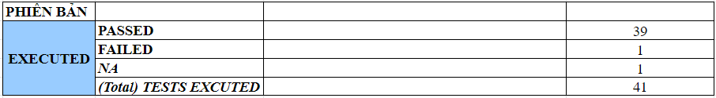
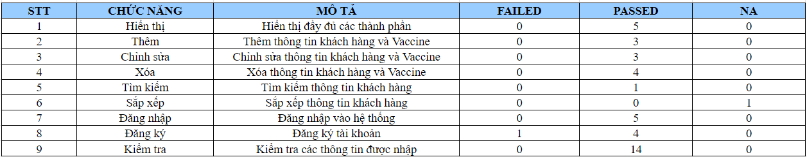

# Đánh giá và kiểm định chất lượng phần mềm
Thành viên thực hiện: Trần Long Hải, Nguyễn Minh Phương

Đề tài: Kiểm thử phần mềm với hệ thống quản lý thông tin tiêm chủng

Máy chủ kiểm thử: Window 11 - AMD Ryzen 7 4000 Series - RAM 8 GB

Chiến lược kiểm thử:  
    - Kiểm thử hộp trắng: Kiểm thử đơn vị  
        Là quá trình kiểm thử từng module nhỏ trong hệ thống nhằm mục đích xác nhận mỗi thành phần của phần mềm đều thực hiện đúng với thiết kế. Trong quá trình kiểm thử, các test cases đảm bảo việc phủ câu lệnh 70%.  
    - Kiểm thử hộp đen:  
        Là phương pháp kiểm thử phần mềm mà việc kiểm tra các chức năng của một ứng dụng không cần quan tâm vào cấu trúc nội bộ. Mục đích chính là để xem phần mềm có hoạt động như dự kiến và liệu có đáp ứng được sự mong đợi của người dùng hay không.

Điều kiện chấp nhận:  
    - Passed các test cases đã được định nghĩa  
    - Hệ thống chạy ổn định, độ bao phủ câu lệnh đạt 70%, các chức năng được cung cấp đầy đủ  
    - Hệ thống server cung cấp đầy đủ services theo yêu cầu

Ngôn ngữ: Java

Công nghệ: IntelliJ, Github, Junit5, Excel, Word

Test Report:

Chức năng:

